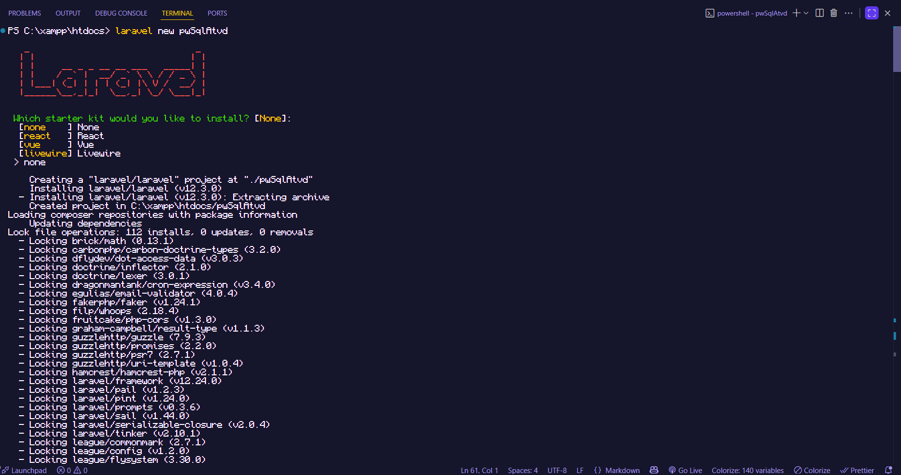

# Projeto Laravel - Alunos
````markdown
Este projeto foi desenvolvido como parte da atividade de PHP com Laravel e MySQL.  
O objetivo é criar um projeto Laravel chamado **Alunos**, configurar o banco de dados MySQL e gerar uma tabela `alunos` via migration.
````

## 🚀 Requisitos para rodar o projeto

- PHP instalado
- Composer instalado
- MySQL instalado e rodando
- Editor de código VS Code

## 📌 Passo a passo de instalação

### 1️⃣ Criar um novo projeto Laravel chamado **Alunos**

composer create-project laravel/laravel Alunos

### 2️⃣ Configurar o banco de dados

No arquivo `.env`, configure as credenciais do seu MySQL:

```env
DB_CONNECTION=mysql
DB_HOST=127.0.0.1
DB_PORT=3306
DB_DATABASE=alunos_db
DB_USERNAME=seu_usuario
DB_PASSWORD=sua_senha
```

### 3️⃣ Criar a migration para a tabela `alunos`

```
php artisan make:migration create_alunos_table --create=alunos
```

### 4️⃣ Configurar os campos no arquivo da migration

```php
public function up()
{
    Schema::create('alunos', function (Blueprint $table) {
        $table->id();
        $table->string('nome', 100);
        $table->string('telefone', 20)->nullable();
        $table->string('email', 150)->unique();
        $table->string('motivo_contato', 255)->nullable();
        $table->text('mensagem')->nullable();
        $table->timestamps();
    });
}
```

### 5️⃣ Rodar a migration

```bash
php artisan migrate
```


## 📷 Capturas de tela

**Instalação do Laravel**


**Execução da Migration**


## 📜 Autor

* **Enzo Pereira - 3°DS**